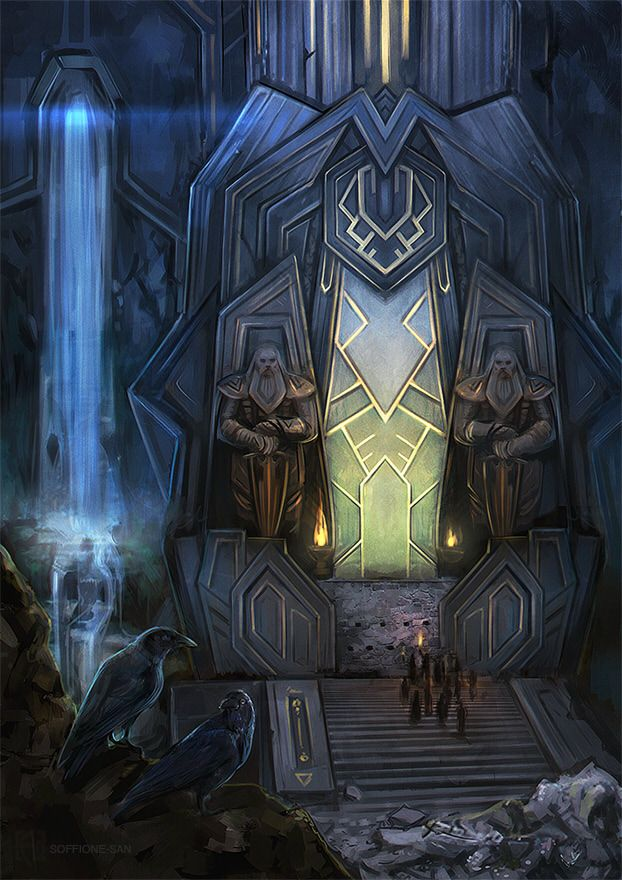

> Out of doubt, out of dark, to the day's rising

Éomer


[![Hercules CI][hci badge]][hci link]
[![Built With Nix][bwn badge]][bwn link]

[bwn badge]: https://builtwithnix.org/badge.svg
[bwn link]: https://builtwithnix.org
[hci badge]: https://hercules-ci.com/api/v1/site/github/account/quinn-dougherty/project/declare/badge
[hci link]: https://hercules-ci.com/github/quinn-dougherty/declare/status

|  Machine   | Function                                      |
| :--------: | :-------------------------------------------- |
| `fixpoint` | daily driver (framework 13 batch 5)           |
|  `yoneda`  | hercules ci, jellyfin, vaultwarden (onprem)   |
|  `cofix`   | just `homeManagerConfiguration` for a Manjaro |

There's a bunch of dead code in here, inactive modules and even inactive hosts.

## Developer shells

I have very basic shells for modest and generic projects in rust, js, python, coq, ocaml, haskell. Suitable for bootstrapping.

```sh
nix develop github:quinn-dougherty/declare#rust
nix develop github:quinn-dougherty/declare#python
```

Including for monorepos of up to three different kits (these are examples, but you can use any permutation of the 6)

```sh
nix develop github:quinn-dougherty/declare#python-ocaml
nix develop github:quinn-dougherty/declare#js-rust
nix develop github:quinn-dougherty/declare#haskell-coq-js
nix develop github:quinn-dougherty/declare#python-rust-js
```

The shells are the only aspect of these repo that's vendored for direct usage.


