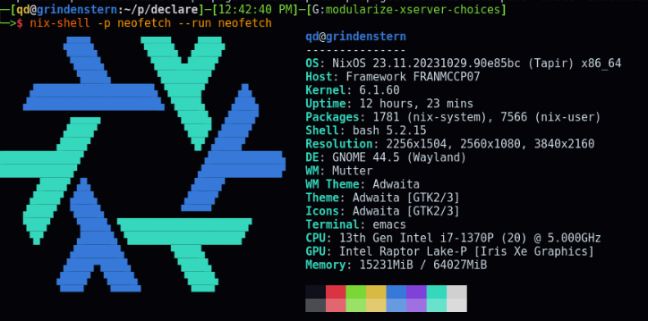

# Framework (daily driver)

Includes:

- `xmonad` and `xmobar` config
- Development environments for several ecosystems, which I access all at once by a `.envrc` in `$HOME`.
- My `$DOOMDIR` declaring my emacs build
- `home-manager` as a module of the flake
