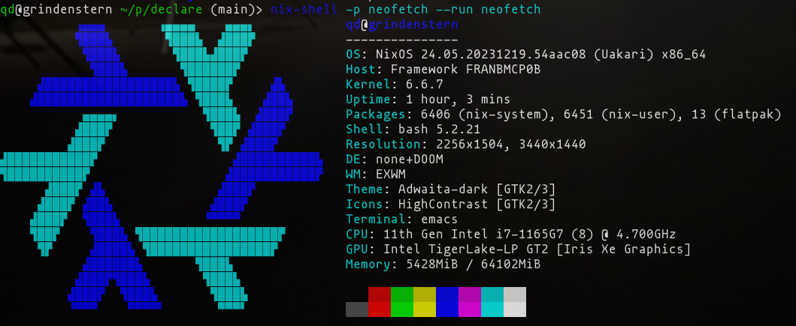

[![made-w-doom-emacs][doom-badge]][doom-repo]

[doom-badge]: https://img.shields.io/badge/Made_with-Doom_Emacs-blueviolet.svg?style=flat-square&logo=GNU%20Emacs&logoColor=white
[doom-repo]: https://github.com/hlissner/doom-emacs

# Framework (daily driver)

Includes my `$DOOMDIR` declaring my emacs build
