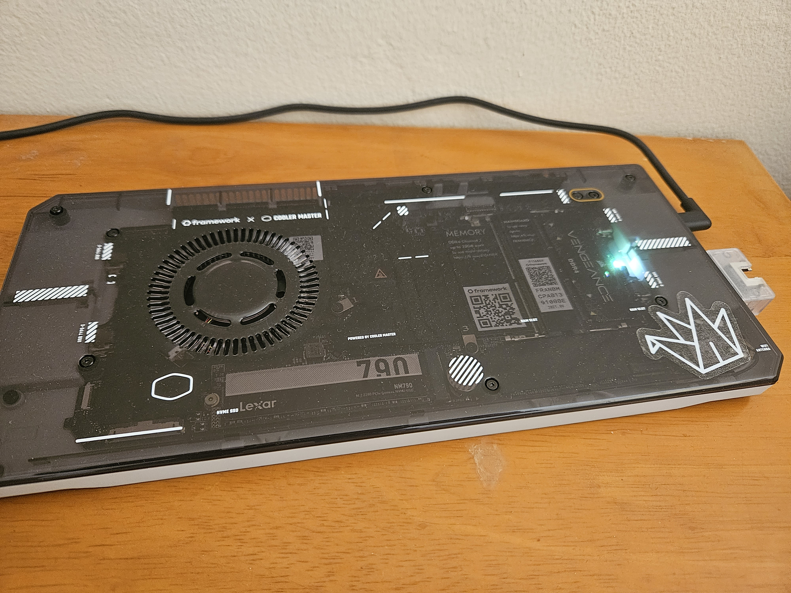

# [Herc CI agent](https://docs.hercules-ci.com/hercules-ci-agent/)



```
[admin@grind:~]$ nix-shell -p neofetch --run neofetch
          ▗▄▄▄       ▗▄▄▄▄    ▄▄▄▖            admin@grind
          ▜███▙       ▜███▙  ▟███▛            -----------
           ▜███▙       ▜███▙▟███▛             OS: NixOS 24.11.20240701.00d80d1 (Vicuna) x86_64
            ▜███▙       ▜██████▛              Host: Framework FRANMCCP07
     ▟█████████████████▙ ▜████▛     ▟▙        Kernel: 6.6.36
    ▟███████████████████▙ ▜███▙    ▟██▙       Uptime: 10 mins
           ▄▄▄▄▖           ▜███▙  ▟███▛       Packages: 1087 (nix-system)
          ▟███▛             ▜██▛ ▟███▛        Shell: bash 5.2.26
         ▟███▛               ▜▛ ▟███▛         Terminal: /dev/pts/0
▟███████████▛                  ▟██████████▙   CPU: 13th Gen Intel i7-1370P (20) @ 5.000GHz
▜██████████▛                  ▟███████████▛   GPU: Intel Raptor Lake-P [Iris Xe Graphics]
      ▟███▛ ▟▙               ▟███▛            Memory: 1048MiB / 15705MiB
     ▟███▛ ▟██▙             ▟███▛
    ▟███▛  ▜███▙           ▝▀▀▀▀
    ▜██▛    ▜███▙ ▜██████████████████▛
     ▜▛     ▟████▙ ▜████████████████▛
           ▟██████▙       ▜███▙
          ▟███▛▜███▙       ▜███▙
         ▟███▛  ▜███▙       ▜███▙
         ▝▀▀▀    ▀▀▀▀▘       ▀▀▀▘
```

This runs on a framework cooler master build
