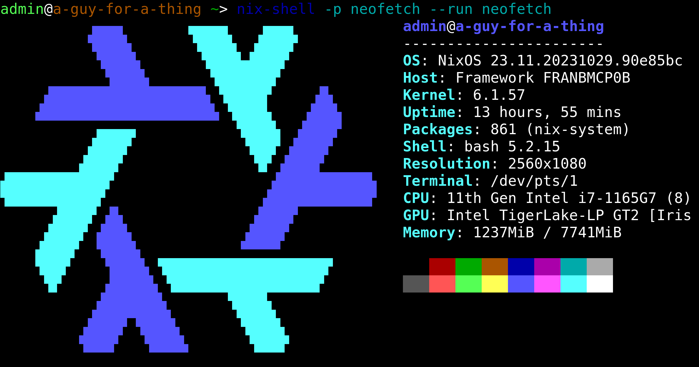

# [Herc CI agent](https://docs.hercules-ci.com/hercules-ci-agent/)

This runs on a framework cooler master build

## Imperative assumptions

This code currently assumes some imperative steps have been taken, like copying over a `hercules-ci-agent/secrets` directory manually.
